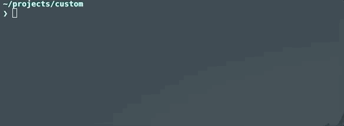
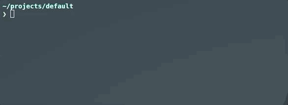

---
tags:
  - v3
search:
  boost: 2
---

The urfave/cli v3 library supports programmable completion for apps utilizing its framework. This means
that the completion is generated dynamically at runtime by invokiong the app itself with a special hidden
flag. The urfave/cli searches for this flag and activates a different flow for command paths than regular flow
The following shells are supported
 - bash
 - zsh
 - fish
 - powershell

Enabling auto complete requires 2 things
 - Setting the `EnableShellCompletion` field on root `Command` object to `true`. 
 - Sourcing the completion script for that particular shell. 

 The completion script for a particular shell can be retrieved by running the "completion" subcommand
 on the app after the `EnableShellCompletion` field on root `Command` object has been set to `true`. 

Consider the following program

```go
package main

import (
	"fmt"
	"log"
	"os"
	"context"

	"github.com/urfave/cli/v3"
)

func main() {
	cmd := &cli.Command{
		Name: "greet",
		EnableShellCompletion: true,
		Commands: []*cli.Command{
			{
				Name:    "add",
				Aliases: []string{"a"},
				Usage:   "add a task to the list",
				Action: func(ctx context.Context, cmd *cli.Command) error {
					fmt.Println("added task: ", cmd.Args().First())
					return nil
				},
			},
			{
				Name:    "complete",
				Aliases: []string{"c"},
				Usage:   "complete a task on the list",
				Action: func(ctx context.Context, cmd *cli.Command) error {
					fmt.Println("completed task: ", cmd.Args().First())
					return nil
				},
			},
			{
				Name:    "template",
				Aliases: []string{"t"},
				Usage:   "options for task templates",
				Commands: []*cli.Command{
					{
						Name:  "add",
						Usage: "add a new template",
						Action: func(ctx context.Context, cmd *cli.Command) error {
							fmt.Println("new task template: ", cmd.Args().First())
							return nil
						},
					},
					{
						Name:  "remove",
						Usage: "remove an existing template",
						Action: func(ctx context.Context, cmd *cli.Command) error {
							fmt.Println("removed task template: ", cmd.Args().First())
							return nil
						},
					},
				},
			},
		},
	}

	if err := cmd.Run(context.Background(), os.Args); err != nil {
		log.Fatal(err)
	}
}
```

After compiling this app as `greet` we can generate the autocompletion as following
in bash script

```sh-session
$ greet completion bash
```

This file can be saved to /etc/bash_completion.d/greet or $HOME/.bash_completion.d/greet
where it will be automatically picked in new bash shells. For the current shell these
can be sourced either using filename or from generation command directly

```sh-session
$ source ~/.bash_completion.d/greet
```

```sh-session
$ source <(greet completion bash)
```

The procedure for other shells is similar to bash though the specific paths for each of the 
shells may vary. Some of the sections below detail the setup need for other shells as
well as examples in those shells.

#### Default auto-completion

```go
package main

import (
	"fmt"
	"log"
	"os"
	"context"

	"github.com/urfave/cli/v3"
)

func main() {
	cmd := &cli.Command{
		EnableShellCompletion: true,
		Commands: []*cli.Command{
			{
				Name:    "add",
				Aliases: []string{"a"},
				Usage:   "add a task to the list",
				Action: func(ctx context.Context, cmd *cli.Command) error {
					fmt.Println("added task: ", cmd.Args().First())
					return nil
				},
			},
			{
				Name:    "complete",
				Aliases: []string{"c"},
				Usage:   "complete a task on the list",
				Action: func(ctx context.Context, cmd *cli.Command) error {
					fmt.Println("completed task: ", cmd.Args().First())
					return nil
				},
			},
			{
				Name:    "template",
				Aliases: []string{"t"},
				Usage:   "options for task templates",
				Commands: []*cli.Command{
					{
						Name:  "add",
						Usage: "add a new template",
						Action: func(ctx context.Context, cmd *cli.Command) error {
							fmt.Println("new task template: ", cmd.Args().First())
							return nil
						},
					},
					{
						Name:  "remove",
						Usage: "remove an existing template",
						Action: func(ctx context.Context, cmd *cli.Command) error {
							fmt.Println("removed task template: ", cmd.Args().First())
							return nil
						},
					},
				},
			},
		},
	}

	if err := cmd.Run(context.Background(), os.Args); err != nil {
		log.Fatal(err)
	}
}
```


#### Custom auto-completion
<!-- {
  "args": ["complete", "&#45;&#45;generate&#45;shell&#45;completion"],
  "output": "laundry"
} -->
```go
package main

import (
	"fmt"
	"log"
	"os"
	"context"

	"github.com/urfave/cli/v3"
)

func main() {
	tasks := []string{"cook", "clean", "laundry", "eat", "sleep", "code"}

	cmd := &cli.Command{
		EnableShellCompletion: true,
		Commands: []*cli.Command{
			{
				Name:    "complete",
				Aliases: []string{"c"},
				Usage:   "complete a task on the list",
				Action: func(ctx context.Context, cmd *cli.Command) error {
					fmt.Println("completed task: ", cmd.Args().First())
					return nil
				},
				ShellComplete: func(ctx context.Context, cmd *cli.Command) {
					// This will complete if no args are passed
					if cmd.NArg() > 0 {
						return
					}
					for _, t := range tasks {
						fmt.Println(t)
					}
				},
			},
		},
	}

	if err := cmd.Run(context.Background(), os.Args); err != nil {
		log.Fatal(err)
	}
}
```


#### Customize a completion command

By default, a completion command is hidden, meaning the command isn't included in the help message.
You can customize it by setting root Command's `ConfigureShellCompletionCommand`.

```go
package main

import (
	"context"
	"fmt"
	"log"
	"os"

	"github.com/urfave/cli/v3"
)

func main() {
	cmd := &cli.Command{
		Name: "greet",
		// EnableShellCompletion is unnecessary
		ConfigureShellCompletionCommand: func(cmd *cli.Command) { // cmd is a completion command
			cmd.Hidden = false // Make a completion command public
			cmd.Usage = "..." // Customize Usage
			cmd.Description = "..." // Customize Description
		},
		Commands: []*cli.Command{
			{
				Name:  "hello",
				Usage: "Say hello",
				Action: func(ctx context.Context, cmd *cli.Command) error {
					fmt.Println("Hello")
					return nil
				},
			},
		},
	}

	if err := cmd.Run(context.Background(), os.Args); err != nil {
		log.Fatal(err)
	}
}
```

#### Customization

The default shell completion flag (`--generate-shell-completion`) is defined as
`cli.EnableShellCompletion`, and may be redefined if desired, e.g.:

<!-- {
  "args": ["&#45;&#45;generate&#45;shell&#45;completion"],
  "output": "wat\nhelp\n"
} -->
```go
package main

import (
	"log"
	"os"
	"context"

	"github.com/urfave/cli/v3"
)

func main() {
	cmd := &cli.Command{
		EnableShellCompletion: true,
		Commands: []*cli.Command{
			{
				Name: "wat",
			},
		},
	}

	if err := cmd.Run(context.Background(), os.Args); err != nil {
		log.Fatal(err)
	}
}
```

#### ZSH Support

Adding the following lines to
your ZSH configuration file (usually `.zshrc`) will allow the auto-completion to
persist across new shells:

```sh-session
$ PROG=<myprogram>
$ source path/to/autocomplete/zsh_autocomplete
```

#### ZSH default auto-complete example


#### PowerShell Support

Generate the completion script as save it to `<my program>.ps1` . This file can be moved to 
anywhere in your file system.  The location of script does not matter, only the file name of the
script has to match the your program's binary name.

To activate it, enter:

```powershell
& path/to/autocomplete/<my program>.ps1
```

To persist across new shells, open the PowerShell profile (with `code $profile`
or `notepad $profile`) and add the line:

```powershell
& path/to/autocomplete/<my program>.ps1
```
